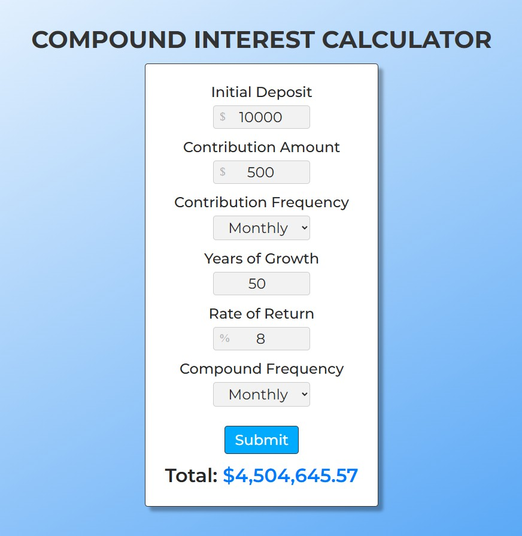

# Compound Interest Calculator

## Project Summary

The Compound Interest Calculator is a clean, responsive web app that helps users estimate the future value of their investments. By entering details like initial deposit, recurring contributions, interest rate, time, and compounding frequency, users receive accurate projections of their investment growth.

Built with HTML, CSS, and JavaScript, this tool showcases the power of simple web technologies in creating useful, real-time financial utilities. It's optimized for mobile and desktop devices and includes accessibility features for a better user experience.

## Table of Contents

- [Mock-Up](#mock-up)
- [Instructions](#instructions)
- [Key Features](#key-features)
- [Deployed Application](#deployed-application)

## Mock-Up

The following image shows the web application's appearance and functionality:

## Instructions

To use this application:

- Clone or download the repository.
- Open `index.html` in your preferred web browser.
- Enter values for your investment scenario.
- Click **Calculate** to see your projected future value.

## Key Features

**Accessible UI:** Includes support for screen readers and keyboard navigation.

**Dynamic Calculations:** Performs real-time compound interest calculations based on user input.

**Responsive Layout:** Designed to work seamlessly across mobile devices, tablets, and large displays.

**User-Centered Design:** Clear form fields, accessible labels, and intuitive button layout improve usability.

**Clean and Lightweight:** Built using only HTML, CSS, and JavaScript—no frameworks or libraries required.

**Flexible Input Options:** Supports a wide range of inputs including deposit amount, recurring contributions, interest rate, growth duration, and compounding settings.

## Deployed Application

[Compound Interest Calculator](https://gilmerperez.github.io/compound-interest-calculator/)
